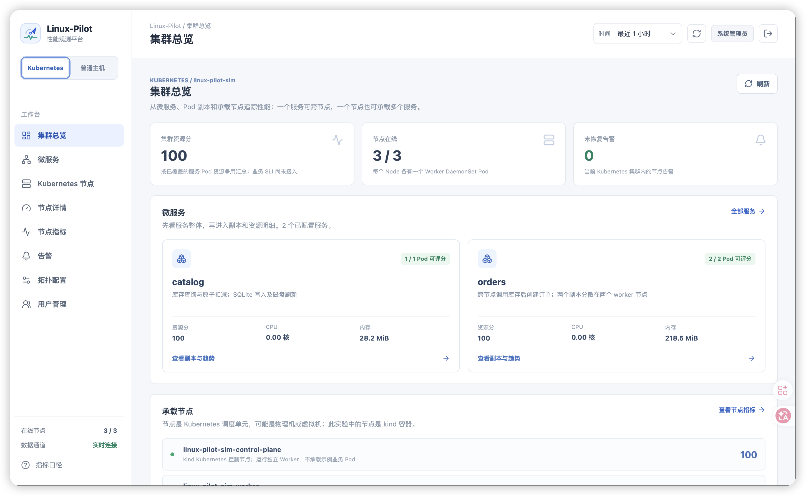
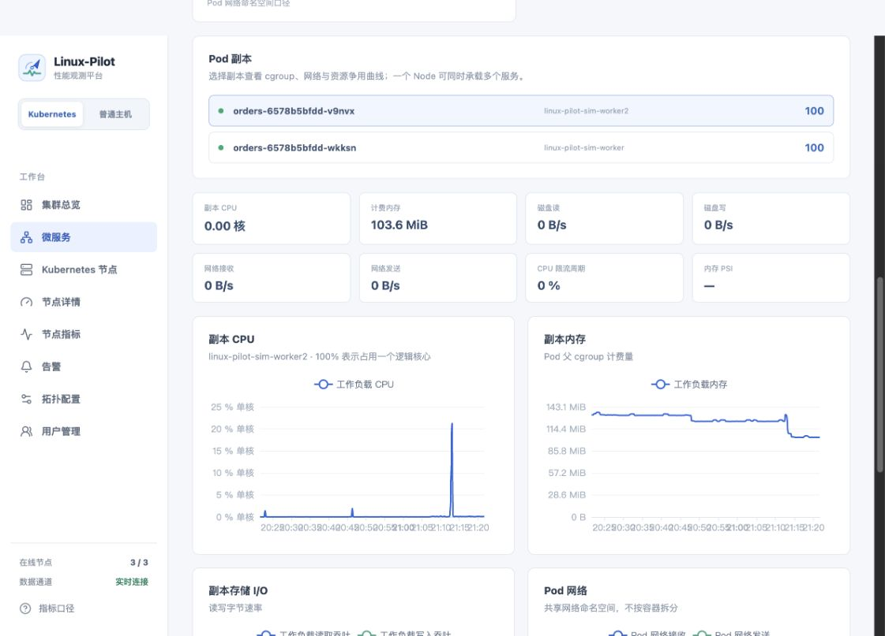
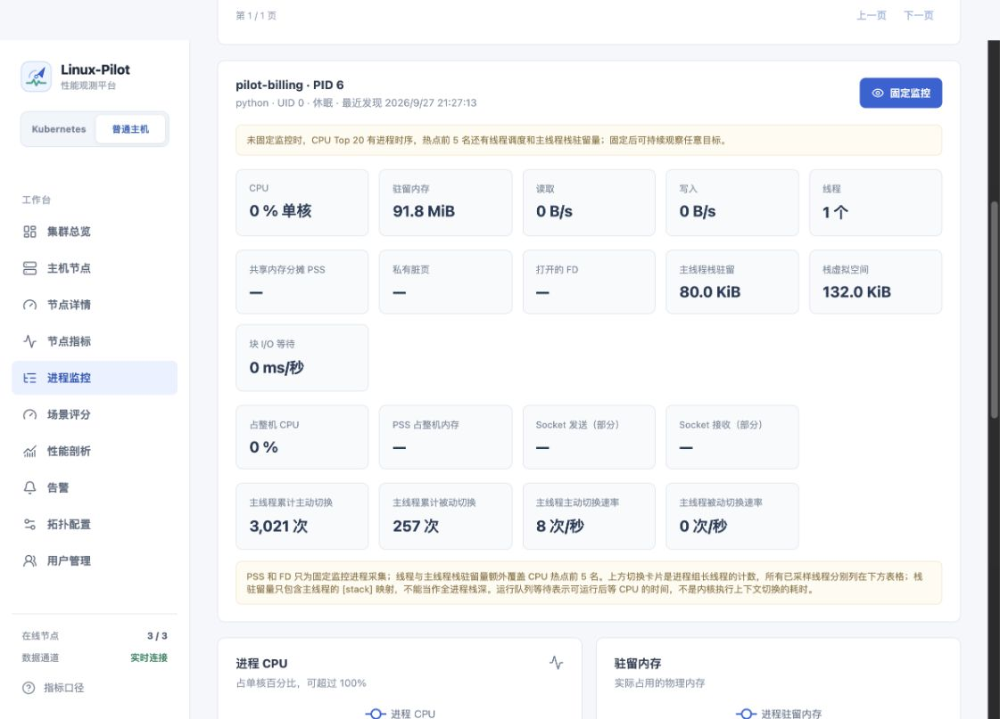
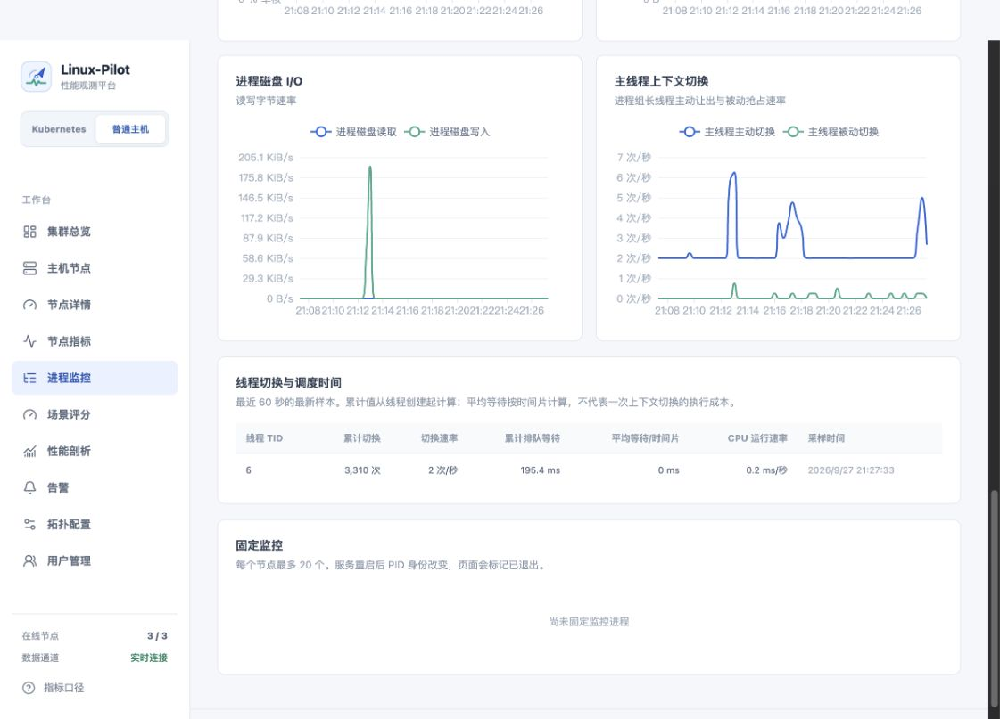
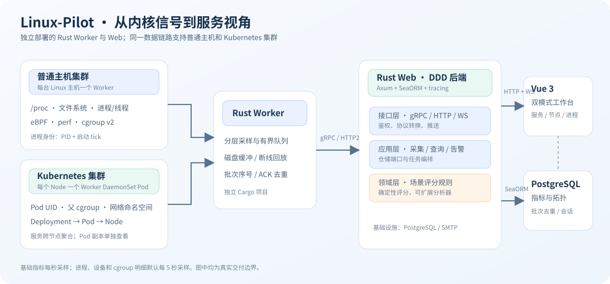

<p align="center"></p>

<h1 align="center">Linux-Pilot</h1>

<p align="center">从 Linux 内核到微服务：在一个工作台中看清资源消耗、调度等待与性能热点。</p>

<p align="center"><a href="#功能">功能</a> · <a href="#特点">特点</a> · <a href="#快速使用">快速使用</a> · <a href="#架构设计">架构设计</a> · <a href="#仿真环境">仿真环境</a> · <a href="#共享与贡献">共享与贡献</a></p>

Linux-Pilot 是开源 Linux 性能观测平台。Rust Worker 部署在 Linux 主机或 Kubernetes Node，中心端用 Rust 处理实时指标、告警与场景评分，Vue 3 工作台分别提供**普通主机集群**和 **Kubernetes 微服务集群**视图。项目目前适合自建观测、研发排障和实验环境验证。

<p align="center"></p>

## 功能

| 视角 | 可以做什么 |
| --- | --- |
| 集群 | 查看资源评分、在线节点、告警、服务覆盖率；按 CPU、I/O、存储等场景使用不同评分权重。 |
| Kubernetes 微服务 | 按 Deployment 查看跨 Node 副本的 CPU、内存、存储 I/O 与 Pod 网络；下钻 Pod 的历史曲线、CPU 限流和资源压力。 |
| 普通主机 | 查看 CPU、内存、网络、磁盘、文件系统、TCP 和 cgroup；通过用户进程清单定位热点并固定监控进程实例。 |
| 进程与线程 | 进程 CPU、内存、磁盘与部分 Socket 流量归因；累计及每秒速率的上下文切换、线程运行与排队等待、主线程栈驻留量。 |
| 内核分析 | eBPF 采集 TCP、块 I/O、调度事件；按需启动 perf CPU 栈采样与火焰图。 |
| 管理 | 邮箱验证码注册、角色与用户管理、操作记录、告警、可视化拓扑配置和 JSON 导入导出。 |

<p align="center"></p>

<p align="center"></p>

<p align="center"></p>

每个指标的单位、意义、数据来源和采集限制见[指标字典](web/docs/metrics.md)。资源分用于发现争用，**不等于业务 SLO 或性能基准分**；没有端到端成功率与延迟时，业务整体分保持空值。

## 特点

- **两个独立的 Rust 项目**：`worker/` 与 `web/` 分别维护 Cargo 工作区、锁文件和部署入口；根目录没有 `Cargo.toml`。
- **低延迟与可靠传输**：Worker 主动建立 gRPC/HTTP2 双向流，批次先落本地磁盘，再发送、确认和断线回放；中心端按批次身份去重。
- **准确的归属边界**：普通主机进程用 `PID + 启动 tick` 区分实例；Kubernetes 用 Deployment、Pod UID 和 Pod 父 cgroup 聚合资源，一个服务可跨多个 Node。
- **可解释的规则评分**：五维场景权重由纯领域服务实现，缺测不填零；拓扑和评分配置可通过版本化 JSON 导入、导出，便于后续自动化分析。
- **按需控制开销**：基础指标每秒采样，设备与工作负载明细默认每 5 秒采样；CPU Top 20 有进程时序，前 5 名和固定监控目标有线程明细。

## 快速使用

需要 Docker Engine 与 Compose v2。以下命令启动 **Web 前端、Rust 后端和 PostgreSQL**；本地邮箱测试额外启动 Mailpit。

```bash
./web/scripts/init-env.sh
docker compose -f compose.yaml -f web/compose.dev.yaml up -d --build
curl http://localhost:3000/health/ready
```

访问 [http://localhost:3000](http://localhost:3000)。内置管理员用户名为 `admin`，固定初始密码和覆盖方法见[管理员说明](web/docs/admin.md)。普通用户可用邮箱验证码注册；本地验证码在 [Mailpit](http://localhost:8025) 查看。[真实 SMTP 配置](web/docs/email.md)完成后，只运行 `docker compose up -d --build` 即可发往真实邮箱。

在需要观测的 **Linux 主机**上单独安装 Worker：

```bash
cd worker
cp .env.example .env
# 配置 PO_AGENT__SERVER_URL、PO_AGENT__TOKEN
./manage.sh start
./manage.sh status
```

Worker 主动连接后端 `50051` 端口；`PO_AGENT__TOKEN` 与 Web `.env` 的 `AGENT_TOKEN` 一致。`./manage.sh build|start|stop|restart|status|logs` 管理独立容器。Worker 的 eBPF 和 perf 需要目标 Linux 内核、相应权限与能力；在 macOS Docker Desktop 运行时观测对象是 Docker Linux VM。[部署架构与生产边界](web/docs/architecture.md)说明 TLS、数据保留和扩容限制。

## 架构设计

<p align="center"></p>

`worker/` 负责 `/proc`、cgroup、eBPF 与 perf；`web/backend/` 按 DDD 分为领域、应用、基础设施和接口层，采用 Axum、SeaORM、`config` 和 `tracing`；`web/frontend/` 为 Vue 3 工作台。后端从 `web/backend/appliaction.yaml` 读取层级配置，环境变量可覆盖配置项。名称保留项目约定的 `appliaction.yaml` 拼写。

Worker 和 Web 各有一份版本化数据契约，以便独立构建与滚动部署。修改协议后运行 `bash web/scripts/check-contracts.sh`。详细的 [DDD 分层、ACK/去重链路与评分边界](web/docs/architecture.md)在架构文档中说明。

## 仿真环境

`virtual_env/` 提供两套可同时运行的实验环境，均使用真实 Linux 服务和 Worker，不向图表注入假数据。

| 模式 | 组成 | 启动与制造负载 |
| --- | --- | --- |
| 普通主机集群 | 三个独立 Docker 容器；每个容器一个单体服务与一个 Worker。 | `./virtual_env/standalone/manage.sh up`，然后 `./virtual_env/standalone/manage.sh load --duration 60 --rate 6 --mode mixed` |
| Kubernetes 集群 | kind 的三个 Node；每个 Node 一个 Worker DaemonSet Pod，运行跨节点订单服务与库存服务。 | `./virtual_env/manage.sh up`，然后 `./virtual_env/manage.sh load --duration 60 --rate 4 --mode mixed` |

在工作台左侧切换模式；「拓扑配置」支持编辑节点容量、用途、评分场景和服务归属，并导入/导出 [`linux-pilot.io/v1alpha1` JSON](virtual_env/manifest.json)。两套实验都运行在同一个 Docker Linux VM 上，适合验证归属和功能链路，不能当作独立物理机性能基准。安装条件、业务接口、停止命令与故障排查见[仿真环境指南](virtual_env/README.md)。

## 共享与贡献

欢迎通过 [GitHub Issues](https://github.com/superlxh02/linux-pilot/issues) 报告问题、分享复现脚本或提出改进；提交代码前请阅读[贡献指南](CONTRIBUTING.md)。复现问题时可附上经过脱敏的拓扑 JSON、指标名、内核版本及 Worker 日志，不要提交 `.env` 或访问令牌。项目采用 [MIT License](LICENSE)。

当前版本的限制包括：中心端以单实例为目标，原始指标默认保留 7 天；进程 Socket 计数只覆盖部分系统调用；逐线程真实栈深、业务 SLO 和 AI 根因分析尚未提供。指标缺失会显示为空值，具体口径见[指标字典](web/docs/metrics.md)。
