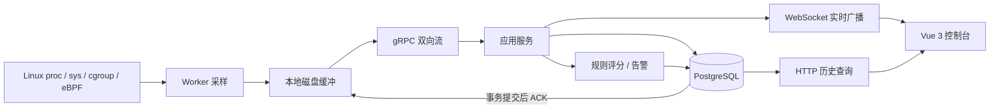

# 架构说明

Linux-Pilot 由两个可独立交付的 Rust 项目组成：`worker/` 是每台 Linux 主机的采集进程，`web/` 是中心控制面。Vue 3 控制台和静态官网同在 `web/`，但官网可以单独由 GitHub Pages 托管。根目录没有 Cargo 工作区；两个 Rust 项目各自有 `Cargo.toml` 和 `Cargo.lock`。

## 数据链路

Worker 每秒读取基础指标，先把批次写入持久目录，再尝试通过 gRPC 发送。网络通道有背压时，采样循环仍继续；连接恢复后按序重放未确认文件。Web 在同一数据库事务中写入指标和 `(host_id, boot_id, sequence)` 去重键，提交后才回复 ACK。无效输入会收到 Reject 并由 Worker 隔离；数据库暂时故障不回复 ACK，等待重传。磁盘缓冲有容量上限，达到上限时会丢弃最老批次并上报丢弃计数。

进程清单每 15 秒通过同一可靠批次上传，在事务内更新 `process_inventory` 当前态表，不进入七天原始指标表。后端把 `process_watches` 中最多 20 个固定监控对象作为完整配置，通过双向 gRPC 流下发；Worker 重连时重新同步。每个对象绑定 PID 与 `/proc/<pid>/stat` 的启动 tick，PID 复用不会混入旧进程时序。CPU 热点前 20 个进程有基础明细，其中前 5 个自动采集线程调度和主线程栈驻留量；固定监控对象无论排名如何也采集这两类明细。每个对象最多扫描 128 个线程，`smaps` 最多读取 8 MiB，以控制高基数和采集开销。进程详细指标仍按 Worker 明细采样频率写入常规指标表；文件系统、cgroup 和进程图表使用标签过滤并由 PostgreSQL 按时间桶聚合。

## 双模式拓扑与评分

版本化 `TopologyManifest` 同时描述 Kubernetes 集群和普通主机集群。配置层保存 Cluster、Node 的角色与声明容量、评分 Profile、Service 的稳定选择器；采集数据、Pod UID 和当前进程 PID 属于运行时事实，不能写成静态配置。可视化编辑器与 JSON 导入/导出使用同一份契约，更新采用 revision 乐观锁。

Kubernetes 模式为每个 Node 部署一个 Worker DaemonSet Pod。本地 kind 实验包括控制面 Node；生产环境是否监控控制面取决于污点与权限策略。只读发现器将 Deployment 身份映射到动态 Pod UID；服务聚合按 Pod 父 cgroup 取一次 CPU、内存和 I/O，网络取 Pod 命名空间。一个 Node 可承载多个服务，一个服务可跨 Node。页面以集群和服务为入口，Node 详情用于定位承载位置；不展示进程监控入口。

普通主机模式按 `hostId + comm` 将单体服务绑定到运行中的用户态进程，时序查询仍使用 `PID + start_ticks` 防止 PID 复用。页面以集群、主机和进程为入口。本地模拟的三个 Docker 容器各有一份 Worker 与单体应用，但共享同一个 Linux VM 内核，因而不能当作独立物理机比较绝对性能。

节点分使用其 Profile 的五维确定性权重；Kubernetes 集群资源分聚合有完整 Pod 覆盖的服务，普通主机集群资源分聚合有完整指标的节点。缺失采集信号保持空值。端到端成功率、延迟和 SLO 尚未接入时，业务整体分为 `null`，避免把资源健康误报为业务健康。

## Web 后端分层

| 层 | 目录 | 责任 |
| --- | --- | --- |
| 领域 | `backend/domain/`、`contracts/model/` | 指标模型、场景定义、纯规则评分；不依赖 Axum、SeaORM 或 SMTP |
| 应用 | `backend/src/application/` | 批次处理、评分窗口、认证、告警和 perf 用例；依赖仓储/邮件/OAuth 端口 |
| 基础设施 | `backend/src/infrastructure/` | PostgreSQL 事务与迁移、SMTP、GitHub/Google OAuth 适配 |
| 接口 | `backend/src/interfaces/` | HTTP、WebSocket、gRPC 参数与鉴权、协议转换、状态码 |

依赖方向为外层指向内层。评分器返回分数、覆盖率、维度分、扣分因子和缺失项；应用层决定何时持久化，前端负责解释展示。新增 AI 分析时应增加读取已保存证据的应用端口和独立结果模型，不应让模型修改确定性规则分或阻塞采集 ACK。

## 独立部署的协议约束

Worker 和 Web 各自包含 `contracts/model` 与 `contracts/wire`。这种显式复制使 Docker 构建上下文完全独立，但要求修改协议时同步两侧。运行 `bash web/scripts/check-contracts.sh` 可检查模型、Proto、生成脚本和清单一致。`po.agent.v1` 是已发布的 wire namespace，更改产品品牌后仍保留，避免滚动升级时破坏旧 Worker。新增 Protobuf 字段应使用新的字段号。

## 性能与可靠性边界

- 主机汇总每秒上报；设备、进程和 cgroup 明细默认每 5 秒上报，控制时序基数。采集器仍每秒更新累计计数器基线。
- 单连接最多 64 个在途批次；Worker 的实时队列和 gRPC 出站队列均有上限。未成功实时入队的批次保留在磁盘中等待回放。
- 历史查询可在 PostgreSQL 端按时间桶聚合，前端默认只读取无标签汇总，避免下载全量进程明细。
- 密码计算在线程池执行并受并发信号量控制；会话和 OAuth state 存储在数据库中，支持后端重启与多副本共享认证状态。
- 实时事件目前使用后端进程内广播。中心端多副本需要共享事件总线和统一的 Worker 任务路由；当前 Compose 以单副本为目标。

## 配置入口

后端读取 `backend/appliaction.yaml`，环境变量 `PO__DATABASE__URL` 等可逐层覆盖；Docker 镜像通过 `PO_CONFIG` 指向容器内文件。Worker 从 `PO_AGENT__*` 环境变量读取连接与缓冲配置。`PO` 前缀为现有部署接口，品牌更名后保留以兼容旧配置。生产模式会拒绝示例令牌、无 TLS 的 gRPC、非 HTTPS 外部地址和明文测试邮件服务。
